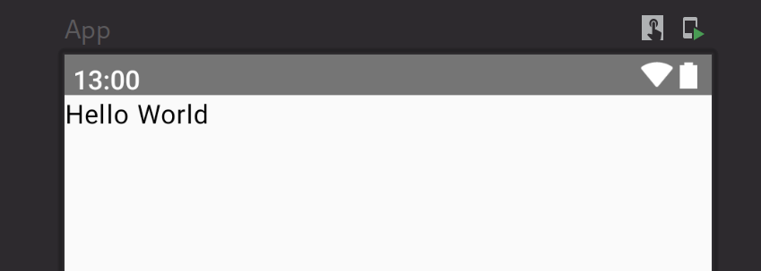
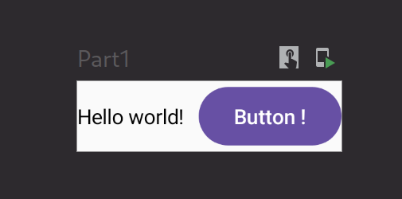
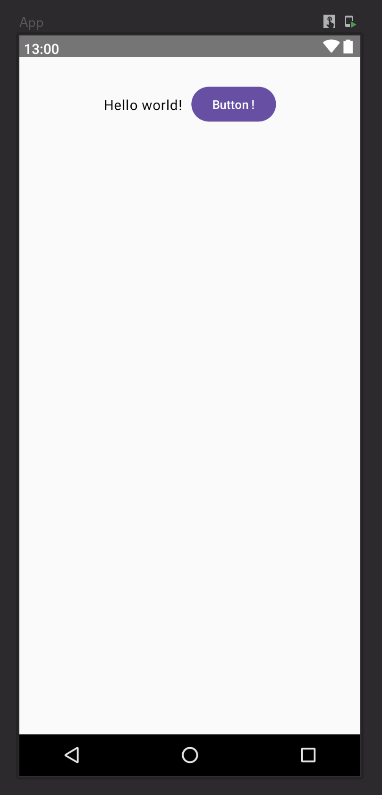
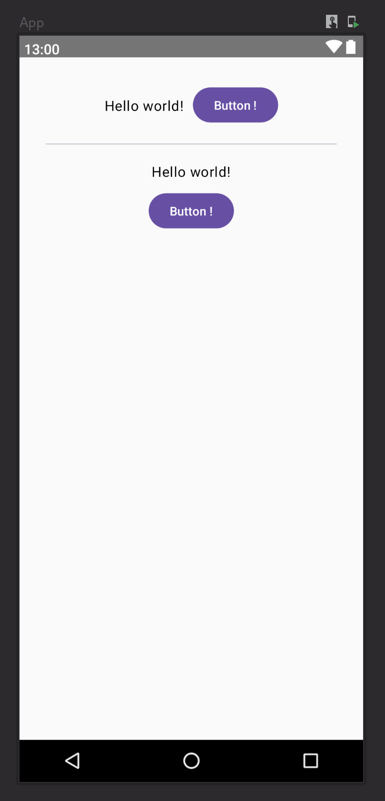
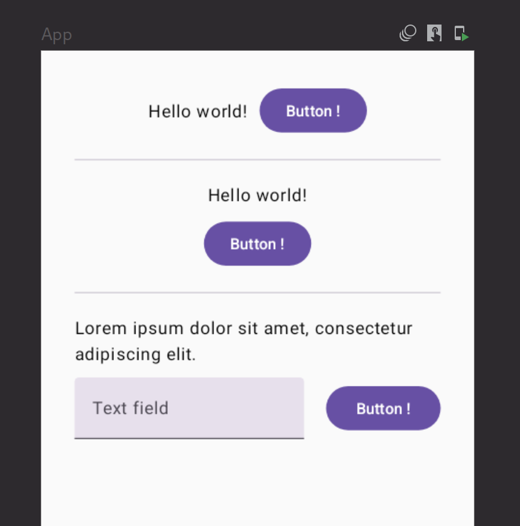

# Handling of layouts (TP2)

- **Cody ADAM** in charge of the Jetpack Compose project
- **Arthur ALLAIN** in charge of the Jetpack XML project

<!-- 
TP report to be handed in to your teacher before : 26/02/2023 at 23h59
Link for the TP report: https://forms.gle/wmTKBZhJPXhckxJ46 
-->


<!-- 
Your lab report should provide all the code and a clear explanation of your implementation for each question.
The implementation can be done in Java or Kotlin. 
All the tools that you will have used for the realization of the TP must be mentioned and their mentioned and their use specified and justified. 
The report of the practical work must mention clearly mention the names of the participants and the number of the practical work and also clearly indicate the questions to which the answers refer. 
-->

## Tasks

1. [Create a Linear layout interface with a text on the left, then a button on the right](#1)
2. [Create a Linear layout interface with a text above, then a button below](#2)
3. [Create a Linear layout interface with a label on top, then a fillable text on the left below a fillable text on the left and a button on the right](#3)
4. [Do the same as in the previous question with a Relative Layout](#4)
5. [Create an interface with a list View that will display the content of an arraylist that you have that you will have filled in beforehand with the names of the 4 Breton departments](#5)
6. [Same exercise as in the previous question but add at the end of the display of each department name the suffix the suffix " - Bretagne" at the end of each department name](#6)
7. [Finally, make it possible to click on each of the items in the list and display a popup with the display a popup with the name of the department and its population which will be stored in another arrayList or a map.](#7)

## Implementations

***Note** : For the UI, we will use the **Material 3** library. This library offer some easy to use and already styled components.*

### 1 

> **Task :** Create a Linear layout interface with a text on the left, then a button on the right

<details>
<summary>Jetpack Compose solution</summary><br/>

First to display something on the app, for example a "Hello World", we need to create a `@Composable` function. This function will be called by the `setContent` function of the `MainActivity` class. 

```kotlin
class MainActivity : ComponentActivity() {
    override fun onCreate(savedInstanceState: Bundle?) {
        super.onCreate(savedInstanceState)
        setContent {
            App()
        }
    }
}

@Composable
@Preview(showBackground = true, showSystemUi = true)
fun App() {
    MaterialTheme {
        Text(text = "Hello World")
    }
}
```

The `@Preview` annotation is used to display the UI in the Android Studio preview. 

This is the result :



In order to display a text on the left and a button on the right, we need to use a `Row` composable. The `Row` composable is a layout composable that places its children horizontally. 


This is the code that solves the task:

```kotlin
@Composable
@Preview(showBackground = true)
fun Part1() {
    Row(
        horizontalArrangement = Arrangement.spacedBy(10.dp),
        verticalAlignment = Alignment.CenterVertically,
    ) {
        Text("Hello world!")
        Button(onClick = {}) {
            Text("Button !")
        }
    }
}
```

If we preview the composable we will have this result :



We can then add this component to the `App` composable with some styling :

```kotlin

@Composable
@Preview(showBackground = true, showSystemUi = true)
fun App() {
    MaterialTheme {
        Box(...) { // used to add padding and scrollable to the content
            Part1()
        }
    }
}
```

The result is the following :



</details>

<details>
<summary>Jetpack XML solution</summary><br/>

TODO
</details>

### 2

> **Task :** Create a Linear layout interface with a text above, then a button below

<details>
<summary>Jetpack Compose solution</summary><br/>

This is very similar to the previous task. We just need to use a `Column` composable instead of a `Row` composable. The `Column` composable is a layout composable that places its children vertically.

```kotlin
@Composable
@Preview(showBackground = true)
fun Part2() {
    Column(
        verticalArrangement = Arrangement.spacedBy(10.dp),
        horizontalAlignment = Alignment.CenterHorizontally,
    ) {
        Text("Hello world!")
        Button(onClick = {}) {
            Text("Button !")
        }
    }
}
```
***Note** : the `Text` and `Button` classes are provided by the `Material 3` library*

We then add this composable to the `App` composable:

```kotlin
@Composable
@Preview(showBackground = true, showSystemUi = true)
@Preview(showBackground = true, heightDp = 1720)
fun App() {
    MaterialTheme {
        Box(...) {
            Column(...) {
                Part1()
                Divider()
                Part2()
            }
        }
    }
}
```

***Note** : The `Divider` composable is provided by the `Material 3` library. It is used to add a separator line between the two parts.*

The result is the following :



</details>

<details>
<summary>Jetpack XML solution</summary><br/>

TODO
</details>

### 3

> **Task :** Create a Linear layout interface with a label on top, then a fillable text on the left below a fillable text on the left and a button on the right

<details>
<summary>Jetpack Compose solution</summary><br/>

To make a more complicated layout, we can simplify the problem by breaking it down into smaller parts. All parts of the layout will be composed of a `Row` and a `Column` composable as we can see below :

```kotlin
@Composable
@Preview(showBackground = true)
fun Part3() {
    Column(
        modifier = Modifier.fillMaxWidth(),
        verticalArrangement = Arrangement.spacedBy(10.dp),
        horizontalAlignment = Alignment.Start,
    ) {
        Text("Lorem ipsum dolor sit amet, consectetur adipiscing elit.")
        Row(
            verticalAlignment = Alignment.CenterVertically,
            horizontalArrangement = Arrangement.spacedBy(20.dp)
        ) {
            TextField(
                value = "",
                onValueChange = {},
                label = { Text("Text field") },
                modifier = Modifier.weight(2f)
            )
            Button(onClick = {}, modifier = Modifier.weight(1f)) {
                Text("Button !")
            }
        }
    }
}
```




</details>


<details>
<summary>Jetpack XML solution</summary><br/>

XML TODO
</details>


### 4

> **Task :** Do the same as in the previous question with a Relative Layout

<details>
<summary>Jetpack Compose solution</summary><br/>

Compose TODO
</details>


<details>
<summary>Jetpack XML solution</summary><br/>

XML TODO
</details>

### 5

> **Task :** Create an interface with a list View that will display the content of an arraylist that you have that you will have filled in beforehand with the names of the 4 Breton departments

<details>
<summary>Jetpack Compose solution</summary><br/>

Compose TODO
</details>


<details>
<summary>Jetpack XML solution</summary><br/>

XML TODO
</details>

### 6

> **Task :** Same exercise as in the previous question but add at the end of the display of each department name the suffix the suffix " - Bretagne" at the end of each department name

<details>
<summary>Jetpack Compose solution</summary><br/>

Compose TODO
</details>


<details>
<summary>Jetpack XML solution</summary><br/>

XML TODO
</details>

### 7

> **Task :** Finally, make it possible to click on each of the items in the list and display a popup with the display a popup with the name of the department and its population which will be stored in another arrayList or a map.

<details>
<summary>Jetpack Compose solution</summary><br/>

Compose TODO
</details>


<details>
<summary>Jetpack XML solution</summary><br/>

XML TODO
</details>