# Handling of layouts (TP2)

If you have not already done so, you can read the [Technology choices](doc/1-tech.md) to understand the choices and the management of the project.

- **Cody ADAM** is in charge of the Jetpack Compose project
- **Arthur ALLAIN** is in charge of the Jetpack XML project

For the XML part, we have chosen to split the question in different functions in the code and display the needed one by uncommenting the line.

In the `AndroidManifest.xml`, to change the displayed Activity, it is need to change the ```<action android:name="android.intent.action.DEFAULT" />``` to ```<action android:name="android.intent.action.MAIN" />```

<!-- 
TP report to be handed in to your teacher before : 26/02/2023 at 23h59
Link for the TP report: https://forms.gle/wmTKBZhJPXhckxJ46 
-->


<!-- 
Your lab report should provide all the code and a clear explanation of your implementation for each question.
The implementation can be done in Java or Kotlin. 
All the tools that you will have used for the realization of the TP must be mentioned and their mentioned and their use specified and justified. 
The report of the practical work must mention clearly mention the names of the participants and the number of the practical work and also clearly indicate the questions to which the answers refer. 
-->

## Tasks

- [1. Create a Linear layout interface with a text on the left, then a button on the right](#1-create-a-linear-layout-interface-with-a-text-on-the-left-then-a-button-on-the-right)
- [2. Create a Linear layout interface with a text above, then a button below](#2-create-a-linear-layout-interface-with-a-text-above-then-a-button-below)
- [3. Create a Linear layout interface with a label on top, then a fillable text on the left below a fillable text on the left and a button on the right](#3-create-a-linear-layout-interface-with-a-label-on-top-then-a-fillable-text-on-the-left-below-a-fillable-text-on-the-left-and-a-button-on-the-right)
- [4. Do the same as in the previous question with a Relative Layout](#4-do-the-same-as-in-the-previous-question-with-a-relative-layout)
- [5. Create an interface with a list View that will display the content of an arraylist that you have that you will have filled in beforehand with the names of the 4 Breton departments](#5-create-an-interface-with-a-list-view-that-will-display-the-content-of-an-arraylist-that-you-have-that-you-will-have-filled-in-beforehand-with-the-names-of-the-4-breton-departments)
- [6. Same exercise as in the previous question but add at the end of the display of each department name the suffix the suffix " - Bretagne" at the end of each department name](#6-same-exercise-as-in-the-previous-question-but-add-at-the-end-of-the-display-of-each-department-name-the-suffix-the-suffix----bretagne-at-the-end-of-each-department-name)
- [7. Finally, make it possible to click on each of the items in the list and display a popup with the display a popup with the name of the department and its population which will be stored in another arrayList or a map.](#7-finally-make-it-possible-to-click-on-each-of-the-items-in-the-list-and-display-a-popup-with-the-display-a-popup-with-the-name-of-the-department-and-its-population-which-will-be-stored-in-another-arraylist-or-a-map)

## Implementations

Click to expand the solution you want to see.

***Note** : For the UI, we will use the **Material 3** library. This library offer some easy to use and already styled components.*

### 1. Create a Linear layout interface with a text on the left, then a button on the right

<details>
<summary>Jetpack Compose solution</summary><br/>

First to display something on the app, for example a "Hello World", we need to create a `@Composable` function. This function will be called by the `setContent` function of the `MainActivity` class. 

```kotlin
class MainActivity : ComponentActivity() {
    override fun onCreate(savedInstanceState: Bundle?) {
        super.onCreate(savedInstanceState)
        setContent {
            App()
        }
    }
}

@Composable
@Preview(showBackground = true, showSystemUi = true)
fun App() {
    MaterialTheme {
        Text(text = "Hello World")
    }
}
```

The `@Preview` annotation is used to display the UI in the Android Studio preview. 

This is the result :

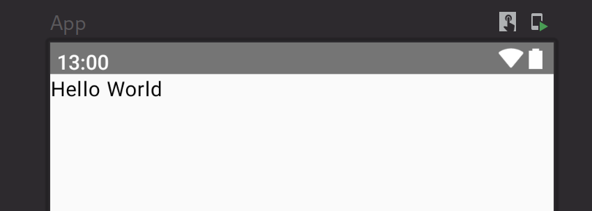

In order to display a text on the left and a button on the right, we need to use a `Row` composable. The `Row` composable is a layout composable that places its children horizontally. 


This is the code that solves the task:

```kotlin
@Composable
@Preview(showBackground = true)
fun Part1() {
    Row(
        horizontalArrangement = Arrangement.spacedBy(10.dp),
        verticalAlignment = Alignment.CenterVertically,
    ) {
        Text("Hello world!")
        Button(onClick = {}) {
            Text("Button !")
        }
    }
}
```
We can note the the `Row` component has two parameters : `horizontalArrangement` and `verticalAlignment`. These parameters are used to specify how the children of the `Row` composable are arranged.

If we preview the composable we will have this result :

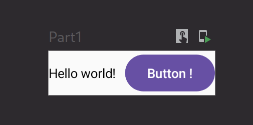

We can then add this component to the `App` composable with some styling :

```kotlin

@Composable
@Preview(showBackground = true, showSystemUi = true)
fun App() {
    MaterialTheme {
        Box(...) { // used to add padding and scrollable to the content
            Part1()
        }
    }
}
```

The result is the following :

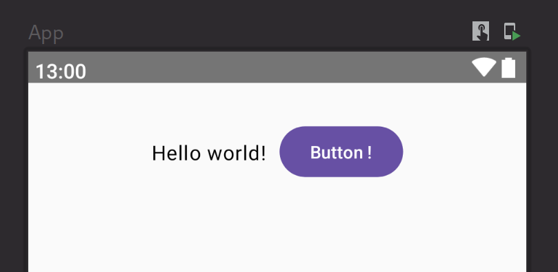

</details>

<details>
<summary>Jetpack XML solution</summary><br/>

First of all, we need to define our `MainActivity` by calling the `super` constructor and calling the fonction of the part `tp2_part1(this)` :

```kotlin
class MainActivityXML : ComponentActivity() {
    override fun onCreate(savedInstanceState: Bundle?) {
        super.onCreate(savedInstanceState)

        tp2_part1(this)
    }
}
```

In the function, we only need to display the `XML content` we want to show to the user :

```kotlin
fun tp2Part1(activity: MainActivityXML) {
    activity.setContentView(R.layout.button_side)
}
```

To display a text on the left and a button on the right in a `LinearLayout`, we can use this code :

```XML
<?xml version="1.0" encoding="utf-8"?>
<LinearLayout xmlns:android="http://schemas.android.com/apk/res/android"
    android:layout_width="match_parent"
    android:layout_height="match_parent">

    <TextView
        android:id="@+id/ClickButton"
        android:layout_width="125dp"
        android:layout_height="wrap_content"
        android:text="Click Button" />

    <Button
        android:id="@+id/button"
        android:layout_width="wrap_content"
        android:layout_height="wrap_content"
        android:text="Button" />
</LinearLayout>
```

By wrapping the content with `wrap_content`, we make sure that the different views only occupy the space corresponding to their size. We also fix the `layout_width` of the `TextView` to a fix value
because it is too small if we don't.

We obtain the following result :

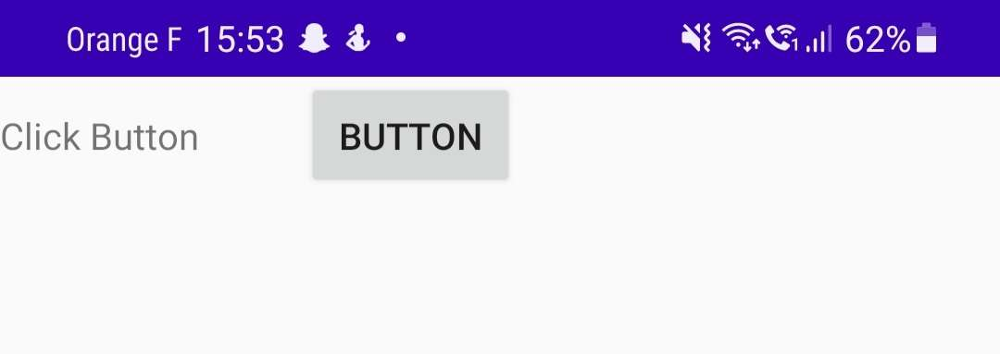

</details>

### 2. Create a Linear layout interface with a text above, then a button below

<details>
<summary>Jetpack Compose solution</summary><br/>

This is very similar to the previous task. We just need to use a `Column` composable instead of a `Row` composable. The `Column` composable is a layout composable that places its children vertically.

```kotlin
@Composable
@Preview(showBackground = true)
fun Part2() {
    Column(
        verticalArrangement = Arrangement.spacedBy(10.dp),
        horizontalAlignment = Alignment.CenterHorizontally,
    ) {
        Text("Hello world!")
        Button(onClick = {}) {
            Text("Button !")
        }
    }
}
```
***Note** : the `Text` and `Button` classes are provided by the `Material 3` library*

We then add this composable to the `App` composable:

```kotlin
@Composable
@Preview(showBackground = true, showSystemUi = true)
@Preview(showBackground = true, heightDp = 1720)
fun App() {
    MaterialTheme {
        Box(...) {
            Column(...) {
                Part1()
                Divider()
                Part2()
            }
        }
    }
}
```

***Note** : The `Divider` composable is provided by the `Material 3` library. It is used to add a separator line between the two parts.*

The result is the following :

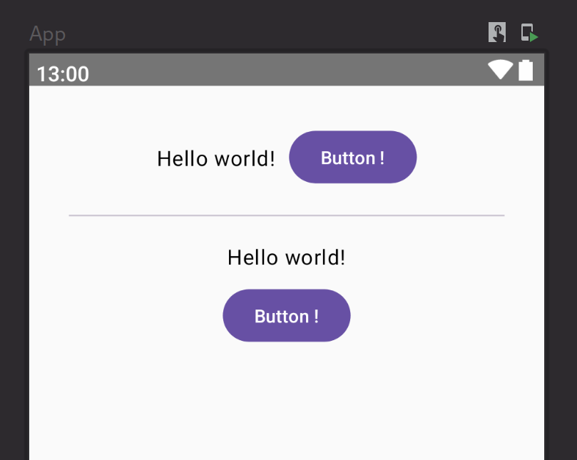

</details>

<details>
<summary>Jetpack XML solution</summary><br/>

We can do almost like we did previously but instead of using the `wrap_content`, we use `match_parent` on the width
to make sure that the text and the button fit the width of the screen. By doing this, the text is button the text :

```kotlin
class MainActivityXML : ComponentActivity() {
    override fun onCreate(savedInstanceState: Bundle?) {
        super.onCreate(savedInstanceState)

        tp2Part2(this)
    }
}

fun tp2Part2(activity: MainActivityXML) {
    activity.setContentView(R.layout.button_bottom)
}
```
```XML
<?xml version="1.0" encoding="utf-8"?>
<LinearLayout xmlns:android="http://schemas.android.com/apk/res/android"
    android:orientation="vertical"
    android:layout_width="match_parent"
    android:layout_height="match_parent">

    <TextView
        android:id="@+id/ClickButtonBottom"
        android:layout_width="match_parent"
        android:layout_height="wrap_content"
        android:text="Click Button" />

    <Button
        android:id="@+id/button2"
        android:layout_width="match_parent"
        android:layout_height="wrap_content"
        android:text="Button" />
</LinearLayout>
```

Because the orientation of the `LinearLayout` is vertical, it works well. We obtain the following result :

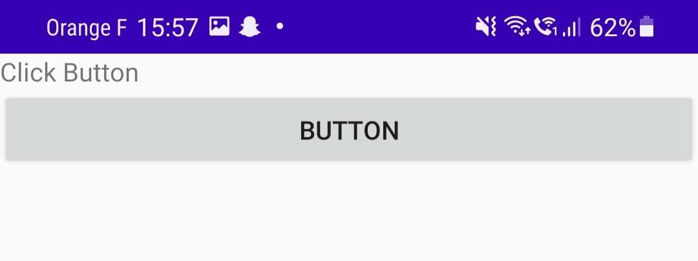

</details>

### 3. Create a Linear layout interface with a label on top, then a fillable text on the left below a fillable text on the left and a button on the right

<details>
<summary>Jetpack Compose solution</summary><br/>

To make a more complicated layout, we can simplify the problem by breaking it down into smaller parts. All parts of the layout will be composed of a `Row` and a `Column` composable as we can see below :

```kotlin
@Composable
@Preview(showBackground = true)
fun Part3() {
    Column(
        modifier = Modifier.fillMaxWidth(),
        verticalArrangement = Arrangement.spacedBy(10.dp),
        horizontalAlignment = Alignment.Start,
    ) {
        Text("Lorem ipsum dolor sit amet, consectetur adipiscing elit.")
        Row(
            verticalAlignment = Alignment.CenterVertically,
            horizontalArrangement = Arrangement.spacedBy(20.dp)
        ) {
            TextField(
                value = "",
                onValueChange = {},
                label = { Text("Text field") },
                modifier = Modifier.weight(2f)
            )
            Button(onClick = {}, modifier = Modifier.weight(1f)) {
                Text("Button !")
            }
        }
    }
}
```

This is the result of the `Part3` composable added to the `App` composable :

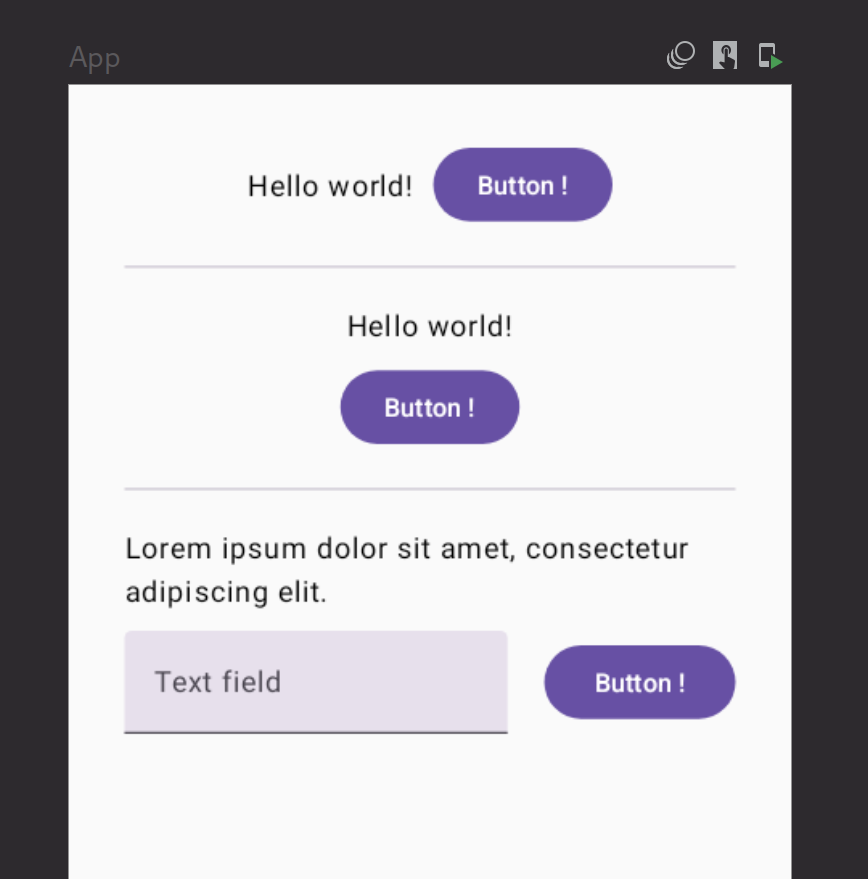


</details>


<details>
<summary>Jetpack XML solution</summary><br/>

To put a label above a group of two other elements, we need to put a `LinearLayout` into the `LinearLayout`
to group the text to fill and the button. As we did in the first part, we put the text to fill next to the button 
by wrapping the content with `wrap_content` on the width : 

```kotlin
class MainActivityXML : ComponentActivity() {
    override fun onCreate(savedInstanceState: Bundle?) {
        super.onCreate(savedInstanceState)

        tp2Part3(this)
    }
}

fun tp2Part3(activity: MainActivityXML) {
    activity.setContentView(R.layout.simple_interface)
}
```
```XML
<?xml version="1.0" encoding="utf-8"?>
<LinearLayout xmlns:android="http://schemas.android.com/apk/res/android"
    android:layout_width="match_parent"
    android:layout_height="match_parent"
    android:orientation="vertical">

    <TextView
        android:id="@+id/Label"
        android:layout_width="match_parent"
        android:layout_height="wrap_content"
        android:text="@string/bienvenue"
        android:textSize="30sp" />

    <LinearLayout
        android:layout_width="wrap_content"
        android:layout_height="wrap_content">
        <EditText
            android:id="@+id/editTextTextPersonName"
            android:layout_width="wrap_content"
            android:layout_height="wrap_content"
            android:ems="10"
            android:inputType="textPersonName"
            android:text="@string/name" />

        <Button
            android:id="@+id/button3"
            android:layout_width="wrap_content"
            android:layout_height="wrap_content"
            android:text="@string/button" />
    </LinearLayout>
</LinearLayout>
```
As we can see, we also wrap the height of the content particularly in the text label because it will
occupy the whole screen if we fit the parent with `match_parent`.

We obtain the following result :

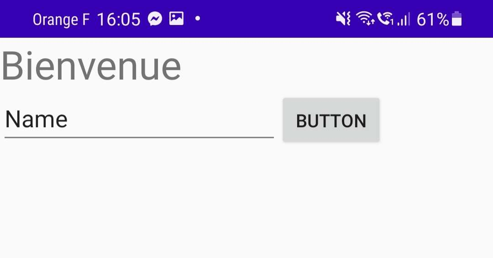

</details>


### 4. Do the same as in the previous question with a Relative Layout

<details>
<summary>Jetpack Compose solution</summary><br/>

With Jetpack Compose, there is no such thing as a `RelativeLayout`.

Which means that the `Part4` composable will be the same as the `Part3` composable :

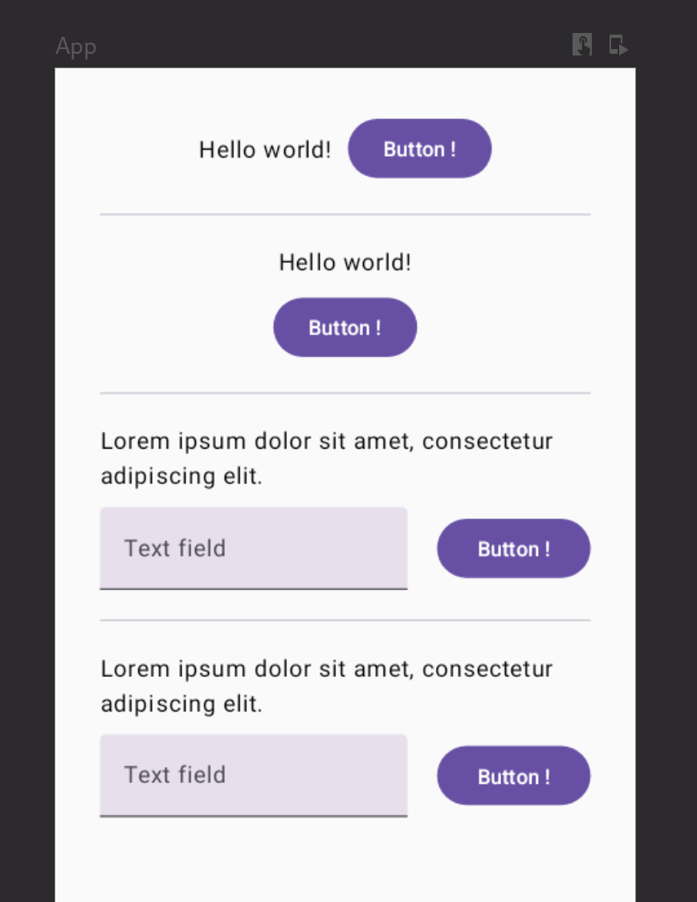
</details>

<details>
<summary>Jetpack XML solution</summary><br/>

With a `RelativeLayout`, we can use only one `Layout` to put all the elements. We just need to precize
the position of every element depending on the other.

```kotlin
class MainActivityXML : ComponentActivity() {
    override fun onCreate(savedInstanceState: Bundle?) {
        super.onCreate(savedInstanceState)

        tp2Part4(this)
    }
}

fun tp2Part4(activity: MainActivityXML) {
    activity.setContentView(R.layout.simple_interface_relative)
}
```
```XML
<?xml version="1.0" encoding="utf-8"?>
<RelativeLayout xmlns:android="http://schemas.android.com/apk/res/android"
    android:orientation="vertical"
    android:layout_width="match_parent"
    android:layout_height="match_parent">

    <TextView
        android:id="@+id/Label"
        android:layout_width="match_parent"
        android:layout_height="wrap_content"
        android:text="@string/bienvenue"
        android:textSize="30sp" />

    <EditText
        android:id="@+id/editTextTextPersonName"
        android:layout_width="wrap_content"
        android:layout_height="wrap_content"
        android:ems="10"
        android:inputType="textPersonName"
        android:text="@string/name"
        android:layout_below="@id/Label"
        android:layout_alignParentStart="true"
        android:layout_toStartOf="@id/button4"
    />

    <Button
        android:id="@+id/button4"
        android:layout_width="wrap_content"
        android:layout_height="wrap_content"
        android:text="@string/button"
        android:layout_alignParentEnd="true"
        android:layout_below="@id/Label"
    />

</RelativeLayout>
```

As we can see, we define the first `TextView` with no indication about the placement, it will be used
as a reference for the others. Then, we define `EditText` view by precising that it is below the `TextView`
called Label with `layout_below="@id/Label"`, aligned on the left with `layout_alignParentStart="true"` and is on the left of the button with
`layout_toStartOf="@id/button4"`.

For the button, this is almost the same thing, by precizing that it is on the right with `layout_alignParentEnd="true"`
and below the text with `layout_below="@id/Label"`. Here we don't need to precise that the button is on the left
of the text to fill, it is implicit.

We obtain the following result :

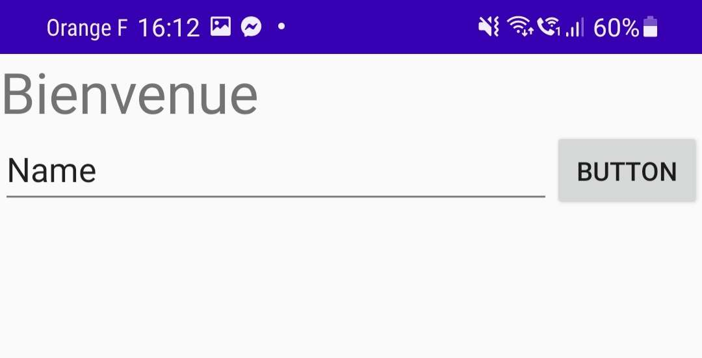

</details>

### 5. Create an interface with a list View that will display the content of an arraylist that you have that you will have filled in beforehand with the names of the 4 Breton departments

<details>
<summary>Jetpack Compose solution</summary><br/>

For this task, we will use the `ListItem` composable provided by the `Material 3` library. This composable is used to display a list item with a title and left icon and a trailing icon.

```kotlin
@Composable
@Preview(showBackground = true)
fun Part5() {
    val names by remember {
        mutableStateOf(
            listOf(
                "Côtes-d'Armor", "Finistère", "Ille-et-Vilaine", "Morbihan"
            )
        )
    }

    Column(
        modifier = Modifier.fillMaxWidth(),
        verticalArrangement = Arrangement.spacedBy(10.dp),
        horizontalAlignment = Alignment.Start,
    ) {
        Text(
            text = "Breton's departments :",
            modifier = Modifier.padding(horizontal = 20.dp, vertical = 10.dp),
            fontSize = 20.sp,
            fontWeight = FontWeight.SemiBold,
        )
        names.forEach { name ->
            ListItem(headlineText = {
                Text(name)
            }, modifier = Modifier.fillMaxWidth(), leadingContent = {
                Icon(
                    Icons.Filled.Favorite,
                    contentDescription = "Localized description",
                )
            },
                shadowElevation = 4.dp
            )
        }
    }
}
```

In the above code, we can spot the use of `mutableStateOf` which is utilitary to store the state of our composable. We need to use this function to track states in Jetpack Compose. It allows us to update the UI when the state changes.

To display the list, we used `forEach` instead of hardcoding the `ListItem` composable. This is a good practice to avoid repeating code.

This is the result of the `Part5` composable added to the `App` composable :

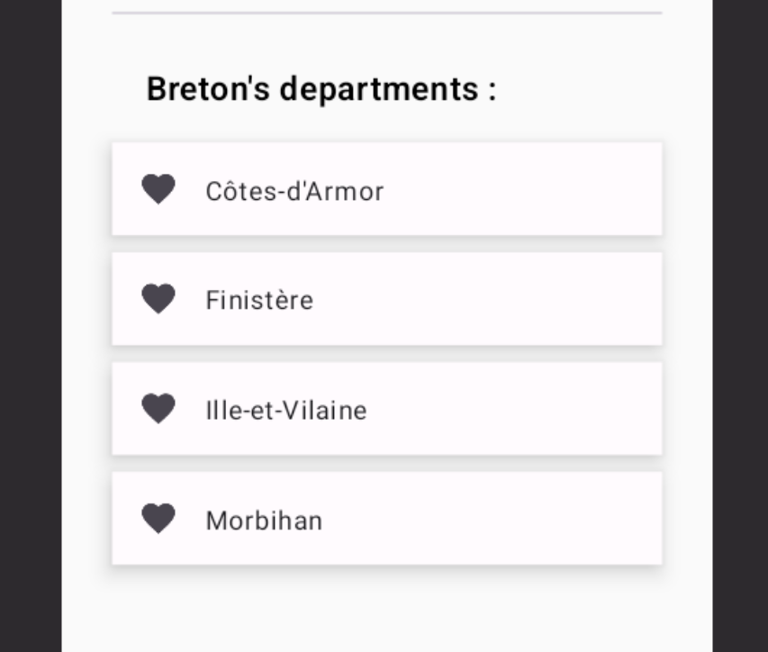
</details>


<details>
<summary>Jetpack XML solution</summary><br/>

To use a `ListView` to display a list, we first need to declare it in an XML file : 

```XML
<?xml version="1.0" encoding="utf-8"?>
<ListView xmlns:android="http://schemas.android.com/apk/res/android"
    android:id="@+id/List"
    android:layout_width="match_parent"
    android:layout_height="match_parent">

</ListView>
```

Then, we need to fill it. We perform this action in the MainActivity :

```kotlin
class MainActivityXML : ComponentActivity() {
    override fun onCreate(savedInstanceState: Bundle?) {
        super.onCreate(savedInstanceState)

        
        tp2Part5(this)
        
    }
}

fun tp2Part5(activity: MainActivityXML) {
    activity.setContentView(R.layout.list_interface)

    val listView : ListView = activity.findViewById(R.id.List)

    val arrayList = ArrayList<String>()
    arrayList.add("Ille-et-Vilaine")
    arrayList.add("Côtes d'Armor")
    arrayList.add("Finistère")
    arrayList.add("Morbihan")

    val arrayAdapter : ArrayAdapter<String> = ArrayAdapter<String>(activity, android.R.layout.simple_list_item_1, arrayList)

    listView.adapter = arrayAdapter

}
```

We can see that we first declared and filled an `ArrayList` with the name of the departements of Brittany. We get the the `ListView` with `activity.findViewById(R.id.List)`,
declare an `ArrayAdapter`, which is a way to turn our list into a XML layout predefine (here the `simple_list_item_1`) and change the `listView.adapter` to the new adapter we just declared.

We obtain the following result :

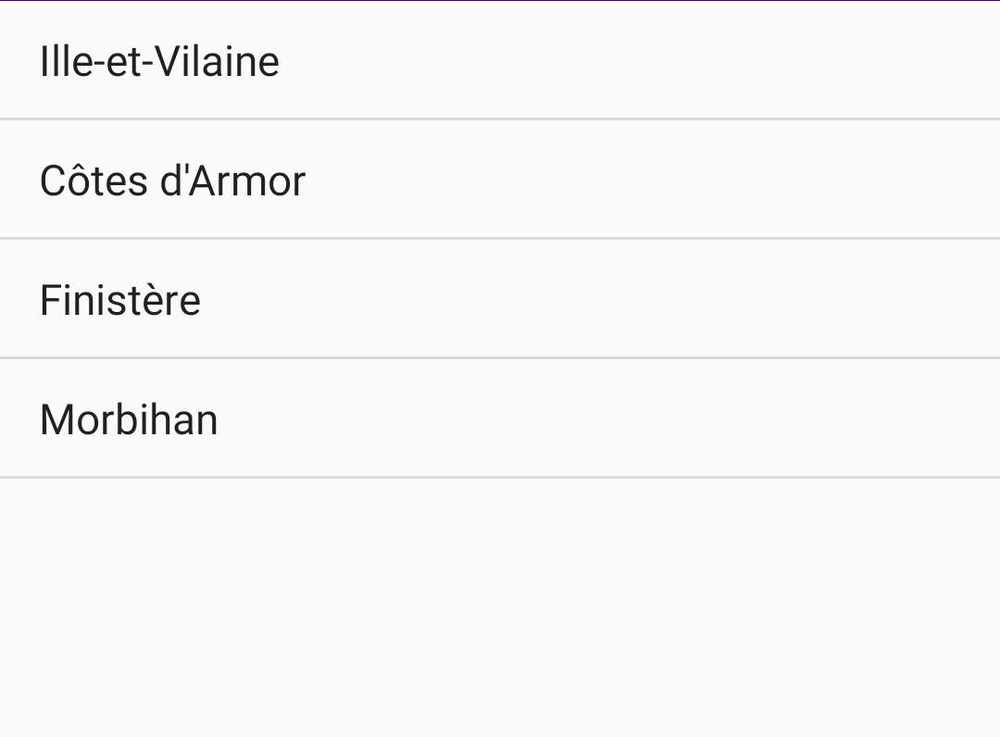

</details>

### 6. Same exercise as in the previous question but add at the end of the display of each department name the suffix the suffix " - Bretagne" at the end of each department name

<details>
<summary>Jetpack Compose solution</summary><br/>

We could fall into the trap of hardcoding the suffix " - Bretagne" in the `ListItem` composable. But this is not a good practice. We should avoid repeating code as much as possible. This method is prone to errors and is not scalable.

Instead we add the suffix before displaying the names.
We only need to change the line :
```kotlin
Text(name)
```

To the following :
```kotlin
Text("$name - Bretagne")
```

Here is a side by side comparison of the `Part5` and `Part6` composables :

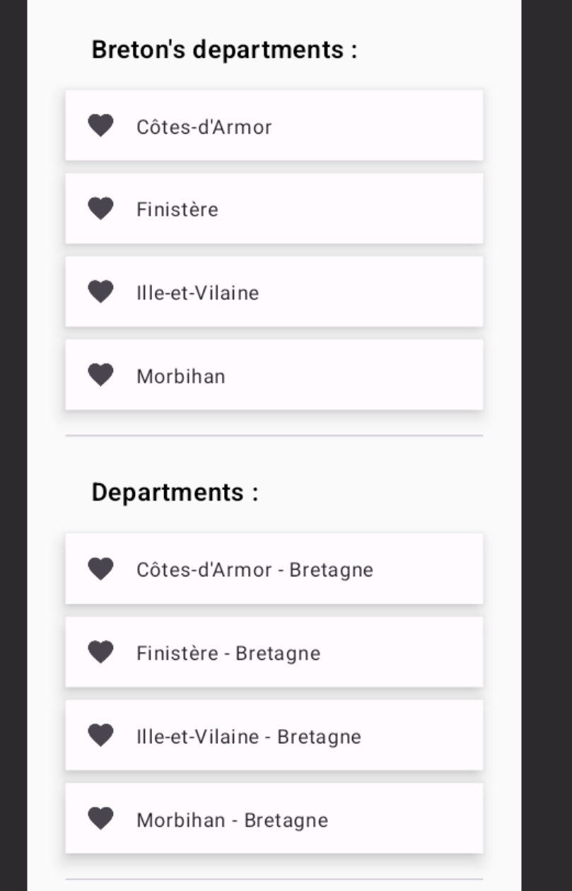

</details>


<details>
<summary>Jetpack XML solution</summary><br/>

Because both the elements (departement name and region name) are strings, we don't need to put two elements per row but just to concatenate both strings in one :

```kotlin
class MainActivityXML : ComponentActivity() {
    override fun onCreate(savedInstanceState: Bundle?) {
        super.onCreate(savedInstanceState)

        
        tp2Part6(this)
        
    }
}

fun tp2Part6(activity: MainActivityXML) {
    activity.setContentView(R.layout.list_interface)

    val listView : ListView = activity.findViewById(R.id.List)

    val arrayList = ArrayList<String>()
    arrayList.add("Ille-et-Vilaine")
    arrayList.add("Côtes d'Armor")
    arrayList.add("Finistère")
    arrayList.add("Morbihan")

    for (i in 0 until arrayList.size) {
        arrayList[i] = (arrayList[i] + " - Bretagne")
    }

    val arrayAdapter : ArrayAdapter<String> = ArrayAdapter<String>(activity, android.R.layout.simple_list_item_1, arrayList)

    listView.adapter = arrayAdapter

}
```

We also use the same layout for the `ListView` as we did before because it works in the same way. We obtain the following result :

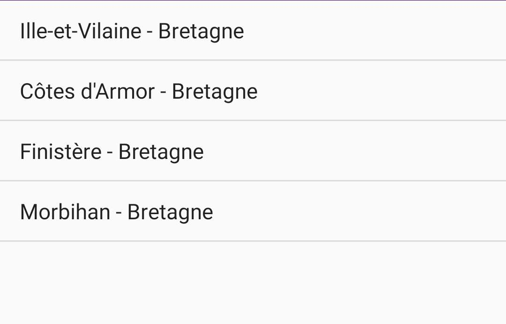

</details>

### 7. Finally, make it possible to click on each of the items in the list and display a popup with the display a popup with the name of the department and its population which will be stored in another arrayList or a map.

<details>
<summary>Jetpack Compose solution</summary><br/>

Let's break down this more complex task.

```kotlin
    val deps by remember {
        mutableStateOf(
            mapOf(
                "Côtes-d'Armor" to "descritpion...",
                "Finistère" to "descritpion...",
                "Ille-et-Vilaine" to "descritpion...",
                "Morbihan" to "descritpion..."
            )
        )
    }
    var openModal by remember { mutableStateOf(false) }
    var selected by remember { mutableStateOf("") }
```
First of all, we have the state `deps` which is no longer an `arraylist` but a `map`. This is because we need to store the description of each department.

Then we have the states `openModal` and `selected` which are used to display the modal. The `openModal` state is used to know if the modal is open or not. The `selected` state is used to know which department is selected.


```kotlin
    Column(
        modifier = Modifier.fillMaxWidth(),
        verticalArrangement = Arrangement.spacedBy(10.dp),
        horizontalAlignment = Alignment.Start,
    ) {
        Text(
            text = "Departments informations :",
            modifier = Modifier.padding(horizontal = 20.dp, vertical = 10.dp),
            fontSize = 20.sp,
            fontWeight = FontWeight.SemiBold,
        )
        deps.forEach { dep ->
            ListItem(
                headlineText = {
                    Text("${dep.key} - Bretagne")
                },
                modifier = Modifier
                    .fillMaxWidth()
                    .clickable { selected = dep.key; openModal = true },
                leadingContent = {
                    Icon(
                        Icons.Filled.Info,
                        contentDescription = "Localized description",
                    )
                },
                trailingContent = {
                    Icon(
                        Icons.Filled.KeyboardArrowRight,
                        contentDescription = "Localized description",
                    )
                },
                shadowElevation = 4.dp
            )
        }
    }
```

Next, we have the list of departments dispay which is quite similar to the previous one. The only difference is that we need to add is the `clickable` modifier to the `ListItem` composable.

```kotlin
    ...
    modifier = Modifier
        .fillMaxWidth()
        .clickable { selected = dep.key; openModal = true },
    ...
```

This modifier is used to make a composable clickable. It takes a lambda as a parameter. In our case, we set the `selected` state to the current department and the `openModal` state to `true`.

```kotlin
    trailingContent = {
        Icon(
            Icons.Filled.KeyboardArrowRight,
            contentDescription = "Localized description",
        )
    },
```

For visual indication that the item is clickable, we also added an icon at the end of the `ListItem` composable.

This is what we currently have :

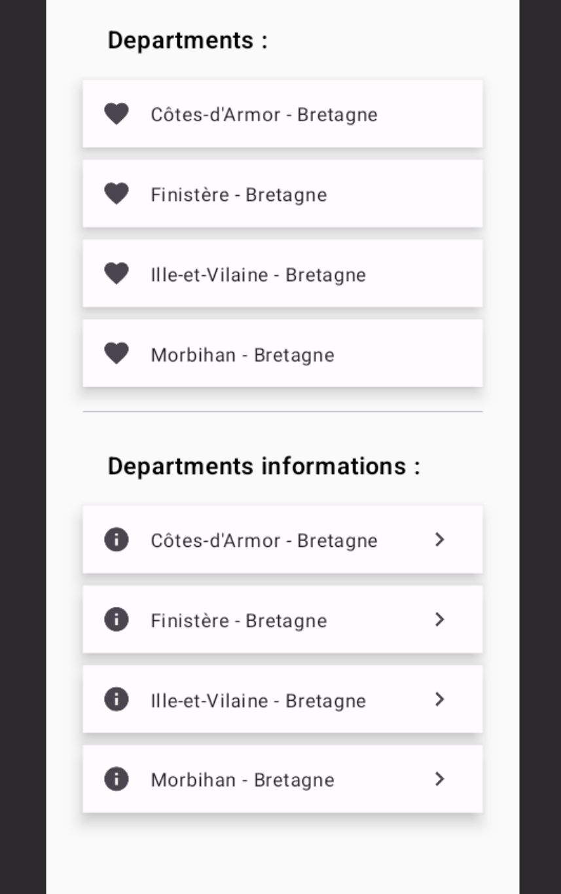

And finally, we have the modal display at the end of the composable.

```kotlin
    if (openModal) {
        ModalBottomSheet(
            onDismissRequest = { openModal = false },
        ) {
            Column(
                modifier = Modifier
                    .fillMaxWidth()
                    .padding(20.dp),
                verticalArrangement = Arrangement.spacedBy(10.dp),
                horizontalAlignment = Alignment.Start,
            ) {
                Text(
                    text = "Informations about $selected",
                    fontSize = 20.sp,
                    fontWeight = FontWeight.Bold,
                )
                Text(deps[selected] ?: "", modifier = Modifier.padding(bottom = 60.dp))
            }
        }
    }
```

This modal is displayed when the `openModal` state is set to `true`. We used the `ModalBottomSheet` composable to display the modal provided by `Material 3` library.

Inside the modal we display the name of the department and its description. The description is stored in the `deps` map.

Note that we use the `onDismissRequest` lambda to set the `openModal` state to `false` when the modal is dismissed.

All the code combined, this is the composable code :


```kotlin
@Composable
@Preview(showBackground = true)
fun Part7() {
    val deps by remember {
        mutableStateOf(
            mapOf(
                "Côtes-d'Armor" to "descritpion...",
                "Finistère" to "descritpion...",
                "Ille-et-Vilaine" to "descritpion...",
                "Morbihan" to "descritpion..."
            )
        )
    }
    var openModal by remember { mutableStateOf(false) }
    var selected by remember { mutableStateOf("") }


    Column(
        modifier = Modifier.fillMaxWidth(),
        verticalArrangement = Arrangement.spacedBy(10.dp),
        horizontalAlignment = Alignment.Start,
    ) {
        Text(
            text = "Departments informations :",
            modifier = Modifier.padding(horizontal = 20.dp, vertical = 10.dp),
            fontSize = 20.sp,
            fontWeight = FontWeight.SemiBold,
        )
        deps.forEach { dep ->
            ListItem(
                headlineText = {
                    Text("${dep.key} - Bretagne")
                },
                modifier = Modifier
                    .fillMaxWidth()
                    .clickable { selected = dep.key; openModal = true },
                leadingContent = {
                    Icon(
                        Icons.Filled.Info,
                        contentDescription = "Localized description",
                    )
                },
                trailingContent = {
                    Icon(
                        Icons.Filled.KeyboardArrowRight,
                        contentDescription = "Localized description",
                    )
                },
                shadowElevation = 4.dp
            )
        }
    }

    if (openModal) {
        ModalBottomSheet(
            onDismissRequest = { openModal = false },
        ) {
            Column(
                modifier = Modifier
                    .fillMaxWidth()
                    .padding(20.dp),
                verticalArrangement = Arrangement.spacedBy(10.dp),
                horizontalAlignment = Alignment.Start,
            ) {
                Text(
                    text = "Informations about $selected",
                    fontSize = 20.sp,
                    fontWeight = FontWeight.Bold,
                )
                Text(deps[selected] ?: "", modifier = Modifier.padding(bottom = 60.dp))
            }
        }
    }
}
```

Here is the result of the `Part7` when we click on the first item :

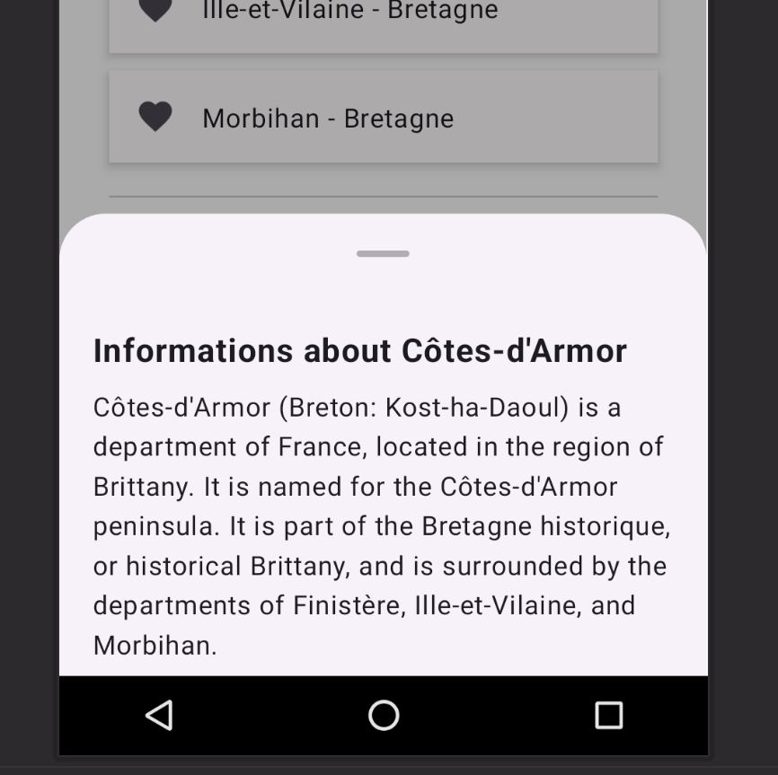

</details>


<details>
<summary>Jetpack XML solution</summary><br/>

Because the elements belong to a `ListView`, they are automatically clickable, we just need to define the event triggered when we click on one of the items :
````kotlin
class MainActivityXML : ComponentActivity() {
    override fun onCreate(savedInstanceState: Bundle?) {
        super.onCreate(savedInstanceState)


        tp2Part7(this)

    }
}

fun tp2Part7(activity: MainActivityXML) {
    activity.setContentView(R.layout.list_interface)

    val listView : ListView = activity.findViewById(R.id.List)

    val arrayList = ArrayList<String>()
    arrayList.add("Ille-et-Vilaine")
    arrayList.add("Côtes d'Armor")
    arrayList.add("Finistère")
    arrayList.add("Morbihan")

    val arrayListPop = ArrayList<String>()
    arrayListPop.add(" 1 060 199")
    arrayListPop.add(" 598 814")
    arrayListPop.add(" 909 028")
    arrayListPop.add(" 750 863")

    for (i in 0 until arrayList.size) {
        arrayList[i] = (arrayList[i] + " - Bretagne")
    }

    val arrayAdapter : ArrayAdapter<String> = ArrayAdapter<String>(activity, android.R.layout.simple_list_item_1, arrayList)

    listView.adapter = arrayAdapter

    //Make a popup appear diplaying the department name and its population
    listView.setOnItemClickListener { parent, view, position, id ->
        //val cityNameMaybe = parent.getItemAtPosition(position.toInt())

        val inflater = LayoutInflater.from(parent.context)
        val popupView = inflater.inflate(R.layout.popup_listview, null)

        val width = LinearLayout.LayoutParams.WRAP_CONTENT
        val height = LinearLayout.LayoutParams.WRAP_CONTENT
        val focusable = true

        val popupWindow = PopupWindow(popupView, width, height, focusable)

        popupWindow.showAtLocation(view, Gravity.CENTER, 0, 0)

        val tv1: TextView = popupView.findViewById(R.id.textView1)
        tv1.text = arrayList[id.toInt()]
        val tv2: TextView = popupView.findViewById(R.id.textView2)
        tv2.text = arrayListPop[id.toInt()]

    }
    
}
````

We can see that we must declare anoter list with the population of each departement. We also need to declare a listener with `listView.setOnItemClickListener`, but it is a listener
on the list, not on an element, that is why we get the needed informations in the listener like the id, parent, view or position.

We also need to declare a new layout :
```XML
<?xml version="1.0" encoding="utf-8"?>
<LinearLayout xmlns:android="http://schemas.android.com/apk/res/android"
    android:orientation="vertical"
    android:layout_width="match_parent"
    android:layout_height="match_parent"
    android:background="#1B000000"
    android:padding="10dp"
    >

    <TextView
        android:id="@+id/textView1"
        android:layout_width="match_parent"
        android:layout_height="wrap_content"
        android:textColor="@color/black"
    />

    <LinearLayout
        android:layout_width="match_parent"
        android:layout_height="match_parent"
        android:orientation="horizontal">

        <TextView
            android:layout_width="wrap_content"
            android:layout_height="wrap_content"
            android:text="@string/population"
            android:textColor="@color/black"
            />

        <TextView
            android:id="@+id/textView2"
            android:layout_width="match_parent"
            android:layout_height="wrap_content"
            android:textColor="@color/black"
            />

    </LinearLayout>


</LinearLayout>
```

It corresponds to the popup displayed when you click on an item with a first `TextView` (the name of the departement) and a `LinearLayout` with two `TextView` (the string "Population" and the
number of inhabitants).

We define and show the popup with the layout :
```kotlin
val inflater = LayoutInflater.from(parent.context)
val popupView = inflater.inflate(R.layout.popup_listview, null)

val width = LinearLayout.LayoutParams.WRAP_CONTENT
val height = LinearLayout.LayoutParams.WRAP_CONTENT
val focusable = true

val popupWindow = PopupWindow(popupView, width, height, focusable)

popupWindow.showAtLocation(view, Gravity.CENTER, 0, 0)
```

Then, we set the information (name and population of the departement) with the id of the item clicked by getting the information in the differents lists declared :

```kotlin
val tv1: TextView = popupView.findViewById(R.id.textView1)
tv1.text = arrayList[id.toInt()]
val tv2: TextView = popupView.findViewById(R.id.textView2)
tv2.text = arrayListPop[id.toInt()]
```


We finally obtain the following result when we click on an element in the list :

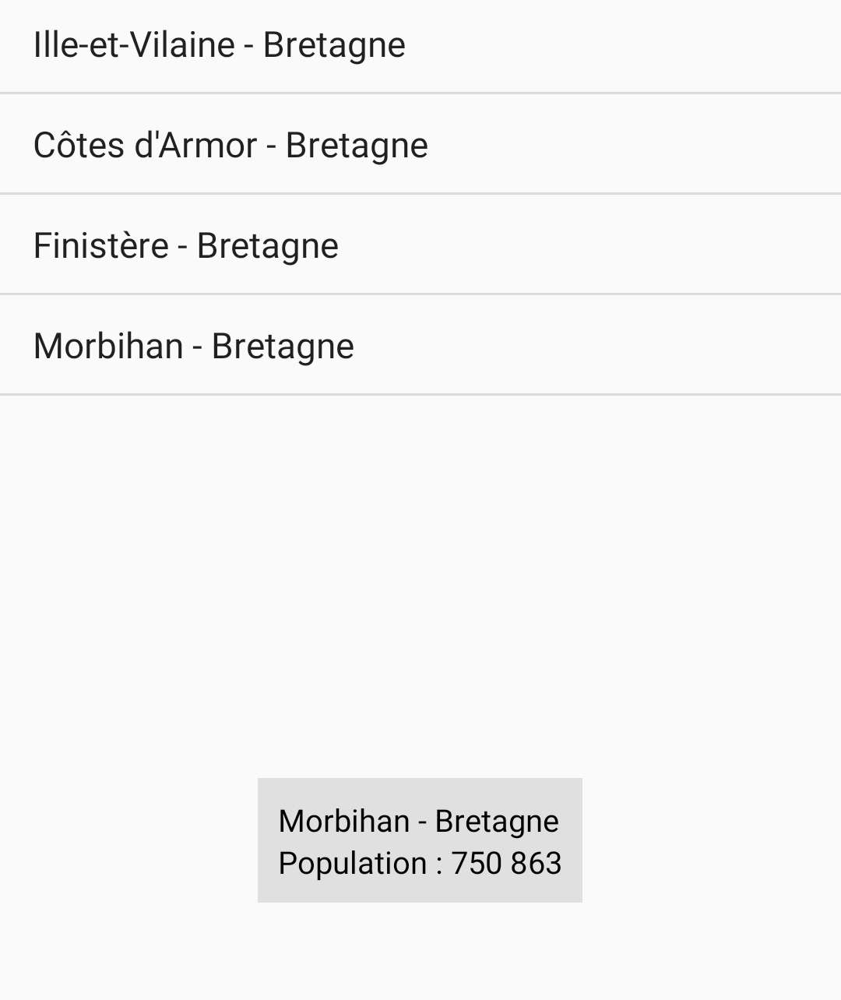

</details>