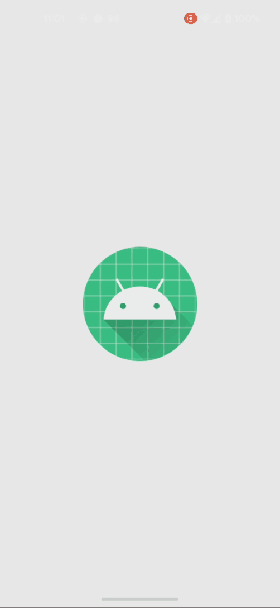

# Handling of layouts (TP2)

- **Cody ADAM** in charge of the Jetpack Compose project
- **Arthur ALLAIN** in charge of the Jetpack XML project


## Tasks


## Implementations

Click to expand the solution you want to see.

<details>
<summary>Jetpack Compose solution</summary>


### Final Demo



To achieve here are the components we used:

- `App` the main component of the application where all the logic is handled
- `MessageInput` (No logic, only UI) component that contains the input and the button to send a message
- `FileContentDisplay` (No logic, only UI) component that displays the content of a file, if there is one
- `StorageDirectory` (No logic, only UI) component that displays the content of a directory

About the UI, the App composable is a `Column` that contains the 3 components above inside a `Column` (see below).

```kotlin
@Composable
private fun App(context: Context) {

    [... logic of the component we will cover later ...]

    MaterialTheme {
        Column(
            Modifier.padding(20.dp)
        ) {
            MessageInput(message, { message = it }, { onSave() }, { onCancel() })
            Spacer(Modifier.height(30.dp))
            FileContentDisplay(file, "adamallain.txt")
            Spacer(Modifier.height(30.dp))
            StorageDirectory(fileList, context.filesDir.absolutePath) { onRemove(it) }
        }
    }
}
```

The 3 other UI components are UI only, and the logic associated with them is passed as parameters. For example, the `MessageInput` component has 3 parameters:

- `message` the message to display in the input
- `onChange` function to call when the message is changed
- `onSave` function to call when the save button is clicked
- `onCancel` function to call when the cancel button is clicked

For this reason, we won't cover them in this document as they are not relevant to the TP. Refer to [the code](../app/src/main/java/com/example/firstapp/ActivityTp3Compose.kt) to see how they are implemented.

### Saving a message to app storage

The main logic of the application is to save a message to the app storage. To do so, we need to:

- Find the app local storage directory
  > We can use the `Context.filesDir` property to get the local storage directory. This is why the activity context is passed as a parameter to the `App` composable.
- Open a file in this directory
  > Now with the path, we open a File, let's say `adamallain.txt`. We use `file = File(context.filesDir, "adamallain.txt")`
- Write the message in the file
  > Then we can write the message in the file with `file.writeText(message)`


Now we make sure to encapsulate this file variable in a `MutableState` to be able to update the UI when the file is modified. And let's put some text in the file when the app starts:
  
```kotlin
var file by remember { mutableStateOf(File(context.filesDir, "adamallain.txt")) }

if (!file.exists()) {
    file.createNewFile()
    file.writeText("Bonjour MOUNIER Romain")
}
```

### Overriding the file content

When the user clicks on the save button, we want to override the file content with the new message from the input. We also want a cancel button to reset the input.

To do so, we first have to create a message state variable that will be updated when the user types in the input. We can do it like this:

```kotlin
var message by remember { mutableStateOf("") }
```

Then can implement the `onSave` and `onCancel` functions passed as parameters to the `MessageInput` component. We can do it like this:

```kotlin
    fun onSave() {
        if (message.isNotEmpty()) {
            file = File(context.filesDir, "adamallain.txt") // We recreate the file to be sure it exists and update the UI
            file.writeText(message)
            message = ""
        } else {
            Toast.makeText(
                context, "Can't save because the message is empty", Toast.LENGTH_LONG
            ).show()
        }
    }

    fun onCancel() {
        message = ""
    }
```

***Note** that we alert the user if the message is empty with a `Toast` alert.*

### Displaying the file content

To display the file content, we can use the `FileContentDisplay` component. We just have to pass the file as a parameter to the component. The component will then use the `file.readText()` function to display the content of the file.

```kotlin
FileContentDisplay(file, "adamallain.txt")
```

### Displaying the file list in app storage

For this part, we will use the `context.filesDir.listFiles()` function to get the list of files in the app storage. We will then pass this list to the `StorageDirectory` component.
  
```kotlin 
var fileList by remember { mutableStateOf(context.filesDir.listFiles() ?: arrayOf()) }
```

We now have a nice list of files in the app storage. But we would like to be able to remove a file from the list. To do so, we will pass a function to the `StorageDirectory` component that will be called when the user clicks on the remove button.

```kotlin
StorageDirectory(fileList, context.filesDir.absolutePath) { onRemove(it) }

...


fun onRemove(file: File) {
    file.delete()
}
```

***Note** that we pass the absolute path of the app storage directory to the component to display it in the UI.*

***Note** that if we remove adamallain.txt, the `FileContentDisplay` composable will display "File not found" instead*

We also need to make sure to update the file list when a file is created or removed :

```kotlin
if (!file.exists()) {
    file.createNewFile()
    file.writeText("Bonjour MOUNIER Romain")
    fileList = context.filesDir.listFiles() ?: arrayOf()
}

...

fun onRemove(file: File) {
    file.delete()
    fileList = context.filesDir.listFiles() ?: arrayOf()
}

...

fun onSave() {
    if (message.isNotEmpty()) {
        file = File(context.filesDir, "adamallain.txt")
        file.writeText(message)
        message = ""
        fileList = context.filesDir.listFiles() ?: arrayOf()
    } else {
        Toast.makeText(
            context, "Can't save because the message is empty", Toast.LENGTH_LONG
        ).show()
    }
}
```

And that's it, we have a fully working app with Jetpack Compose UI and logic.

### Final result


</details>


<details>
<summary>Jetpack XML solution</summary>


### Compose Project


</details>