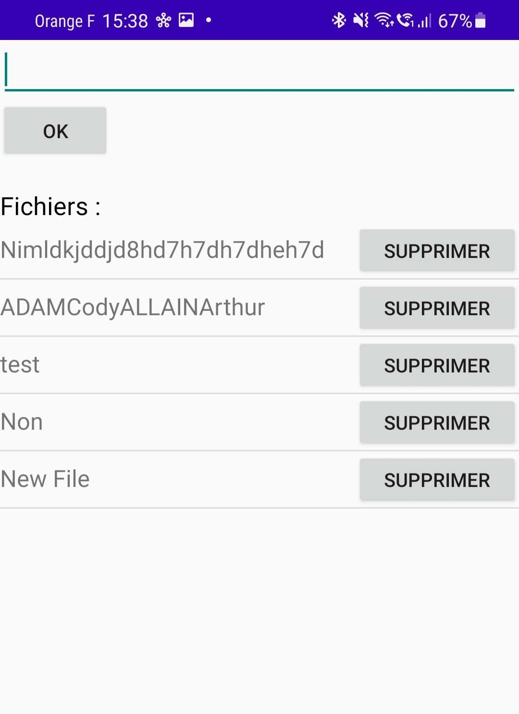

# Handling of layouts (TP3)

- **Cody ADAM** in charge of the Jetpack Compose project
- **Arthur ALLAIN** in charge of the Jetpack XML project

The explanation of the tasks as been detailled in the XML part for every question and a global explanation for the
compose part.

## Tasks

- [1. Create a file in the application storage](#1-create-a-file-in-the-application-storage)
- [2. Write content in the previous file](#2-write-content-in-the-previous-file)
- [3. Display the file content](#3-display-the-file-content)
- [4. Create a simple interface with editable text](#4-create-a-simple-interface-with-editable-text)
- [5. Create a file with OK button](#5-create-a-file-with-ok-button)
- [6. Display the saved files](#6-display-the-saved-files)
- [7. Add a delete button](#7-add-a-delete-button)

## Implementations

Click to expand the solution you want to see.

<details>
<summary>Jetpack Compose solution</summary>


### Final Demo


To achieve here are the components we used:

- `App` the main component of the application where all the logic is handled
- `MessageInput` (No logic, only UI) component that contains the input and the button to send a message
- `FileContentDisplay` (No logic, only UI) component that displays the content of a file, if there is one
- `StorageDirectory` (No logic, only UI) component that displays the content of a directory

About the UI, the App composable is a `Column` that contains the 3 components above inside a `Column` (see below).

```kotlin
@Composable
private fun App(context: Context) {

    [... logic of the component we will cover later ...]

    MaterialTheme {
        Column(
            Modifier.padding(20.dp)
        ) {
            MessageInput(message, { message = it }, { onSave() }, { onCancel() })
            Spacer(Modifier.height(30.dp))
            FileContentDisplay(file, "adamallain.txt")
            Spacer(Modifier.height(30.dp))
            StorageDirectory(fileList, context.filesDir.absolutePath) { onRemove(it) }
        }
    }
}
```

The 3 other UI components are UI only, and the logic associated with them is passed as parameters. For example, the `MessageInput` component has 3 parameters:

- `message` the message to display in the input
- `onChange` function to call when the message is changed
- `onSave` function to call when the save button is clicked
- `onCancel` function to call when the cancel button is clicked

For this reason, we won't cover them in this document as they are not relevant to the TP. Refer to [the code](../app/src/main/java/com/example/firstapp/ActivityTp3Compose.kt) to see how they are implemented.

### Saving a message to app storage

The main logic of the application is to save a message to the app storage. To do so, we need to:

- Find the app local storage directory
  > We can use the `Context.filesDir` property to get the local storage directory. This is why the activity context is passed as a parameter to the `App` composable.
- Open a file in this directory
  > Now with the path, we open a File, let's say `adamallain.txt`. We use `file = File(context.filesDir, "adamallain.txt")`
- Write the message in the file
  > Then we can write the message in the file with `file.writeText(message)`


Now we make sure to encapsulate this file variable in a `MutableState` to be able to update the UI when the file is modified. And let's put some text in the file when the app starts:
  
```kotlin
var file by remember { mutableStateOf(File(context.filesDir, "adamallain.txt")) }

if (!file.exists()) {
    file.createNewFile()
    file.writeText("Bonjour MOUNIER Romain")
}
```

### Overriding the file content

When the user clicks on the save button, we want to override the file content with the new message from the input. We also want a cancel button to reset the input.

To do so, we first have to create a message state variable that will be updated when the user types in the input. We can do it like this:

```kotlin
var message by remember { mutableStateOf("") }
```

Then can implement the `onSave` and `onCancel` functions passed as parameters to the `MessageInput` component. We can do it like this:

```kotlin
    fun onSave() {
        if (message.isNotEmpty()) {
            file = File(context.filesDir, "adamallain.txt") // We recreate the file to be sure it exists and update the UI
            file.writeText(message)
            message = ""
        } else {
            Toast.makeText(
                context, "Can't save because the message is empty", Toast.LENGTH_LONG
            ).show()
        }
    }

    fun onCancel() {
        message = ""
    }
```

***Note** that we alert the user if the message is empty with a `Toast` alert.*

### Displaying the file content

To display the file content, we can use the `FileContentDisplay` component. We just have to pass the file as a parameter to the component. The component will then use the `file.readText()` function to display the content of the file.

```kotlin
FileContentDisplay(file, "adamallain.txt")
```

### Displaying the file list in app storage

For this part, we will use the `context.filesDir.listFiles()` function to get the list of files in the app storage. We will then pass this list to the `StorageDirectory` component.
  
```kotlin 
var fileList by remember { mutableStateOf(context.filesDir.listFiles() ?: arrayOf()) }
```

We now have a nice list of files in the app storage. But we would like to be able to remove a file from the list. To do so, we will pass a function to the `StorageDirectory` component that will be called when the user clicks on the remove button.

```kotlin
StorageDirectory(fileList, context.filesDir.absolutePath) { onRemove(it) }

...


fun onRemove(file: File) {
    file.delete()
}
```

***Note** that we pass the absolute path of the app storage directory to the component to display it in the UI.*

***Note** that if we remove adamallain.txt, the `FileContentDisplay` composable will display "File not found" instead*

We also need to make sure to update the file list when a file is created or removed :

```kotlin
if (!file.exists()) {
    file.createNewFile()
    file.writeText("Bonjour MOUNIER Romain")
    fileList = context.filesDir.listFiles() ?: arrayOf()
}

...

fun onRemove(file: File) {
    file.delete()
    fileList = context.filesDir.listFiles() ?: arrayOf()
}

...

fun onSave() {
    if (message.isNotEmpty()) {
        file = File(context.filesDir, "adamallain.txt")
        file.writeText(message)
        message = ""
        fileList = context.filesDir.listFiles() ?: arrayOf()
    } else {
        Toast.makeText(
            context, "Can't save because the message is empty", Toast.LENGTH_LONG
        ).show()
    }
}
```

And that's it, we have a fully working app with Jetpack Compose UI and logic.

### Final result


</details>


<details>
<summary>Jetpack XML solution</summary>


### 1. Create a file in the application storage

We just need to create the file with the existing method `openFileOutput`:

````kotlin
class MainActivityXML : ComponentActivity() {
  override fun onCreate(savedInstanceState: Bundle?) {
    super.onCreate(savedInstanceState)
    
    tp3Part1(this)

  }
}

fun tp3Part1(activity: MainActivityXML) {
    val fileName = "ADAMCodyALLAINArthur"
    activity.baseContext.openFileOutput(fileName, Context.MODE_PRIVATE)
}
````

We obtain the following result in the file folder at /data/data/com.example.firstapp/files/ADAMCodyALLAINArthur :


### 2. Write content in the previous file

We just have to create the file as we did previously and use the `use` method whend creating the file
to put some content in it.

````kotlin
class MainActivityXML : ComponentActivity() {
  override fun onCreate(savedInstanceState: Bundle?) {
    super.onCreate(savedInstanceState)

    tp3Part2(this)

  }
}

fun tp3Part2(activity: MainActivityXML) {
    val fileName = "ADAMCodyALLAINArthur"
    val fileContent = "Bonjour MOUNIER Romain !"
    activity.baseContext.openFileOutput(fileName, Context.MODE_PRIVATE).use {
        it.write(fileContent.toByteArray())
    }
}
````

We obtain the following file :


### 3. Display the file content

To perform this action, we just have to write in a file just as we did before (or choose an existing file)
and open it with the `openFileInput` to put its content into a `TextView` to allow us to see its content.

````kotlin
class MainActivityXML : ComponentActivity() {
  override fun onCreate(savedInstanceState: Bundle?) {
    super.onCreate(savedInstanceState)

    tp3Part3(this)

  }
}

fun tp3Part3(activity: MainActivityXML) {
    activity.setContentView(R.layout.display_filename)
    val fileName = "ADAMCodyALLAINArthur"
    val fileContent = "Bonjour MOUNIER Romain !"
    activity.baseContext.openFileOutput(fileName, Context.MODE_PRIVATE).use {
        it.write(fileContent.toByteArray())
    }
    activity.baseContext.openFileInput("ADAMCodyALLAINArthur").bufferedReader().use {
        val tv: TextView = activity.findViewById(R.id.textView)
        tv.text = it.readText()
    }
}
````

We obtain the following result :


### 4. Create a simple interface with editable text

As we did in the previous part, we must initialize a file by creating it and filling it with some content.

````kotlin
class MainActivityXML : ComponentActivity() {
  override fun onCreate(savedInstanceState: Bundle?) {
    super.onCreate(savedInstanceState)

    tp3Part4(this)

  }
}

fun tp3Part4(activity: MainActivityXML) {
    activity.setContentView(R.layout.write_okcancel)
    val fileName = "ADAMCodyALLAINArthur"
    val fileContent = "Bonjour MOUNIER Romain !"
    activity.baseContext.openFileOutput(fileName, Context.MODE_PRIVATE).use {
        it.write(fileContent.toByteArray())
    }
    activity.baseContext.openFileInput("ADAMCodyALLAINArthur").bufferedReader().use {
        val tv: TextView = activity.findViewById(R.id.editText)
        tv.text = it.readText()
    }
    val button5: Button = activity.findViewById(R.id.button5)
    button5.setOnClickListener {
        activity.baseContext.openFileOutput(fileName, Context.MODE_PRIVATE).use {
            val tv: TextView = activity.findViewById(R.id.editText)
            it.write((tv.text).toString().toByteArray())
        }
    }
    val button6: Button = activity.findViewById(R.id.button6)
    button6.setOnClickListener {
        activity.baseContext.openFileInput("ADAMCodyALLAINArthur").bufferedReader().use {
            val tv: TextView = activity.findViewById(R.id.editText)
            tv.text = it.readText()
        }
    }
}
````

We can see that after initializing the file, we put a listener on two buttons with the method `setOnClickListener`
to perform an action we clicking on the button. 

On the first button (the OK button), we write a file with the same name as the previous file but with the content
of the editable text. It will overwrite the current file. We do this by getting the view with `findViewById` and writing the text turned into a byte array
with `toByteArray`.

On the second button (the Cancel button), we get the content and set the text with the content of the file as we
did in the part3. By doing that, we just reset the text if it has been edited. 

To display the label and the buttons we use the following XML layout :

````XML
<?xml version="1.0" encoding="utf-8"?>
<LinearLayout xmlns:android="http://schemas.android.com/apk/res/android"
    android:orientation="vertical"
    android:layout_width="match_parent"
    android:layout_height="match_parent">

    <EditText
        android:id="@+id/editText"
        android:layout_width="match_parent"
        android:layout_height="wrap_content"
        android:ems="10"
        android:inputType="textPersonName"
        android:text="" />

    <LinearLayout
        android:layout_width="match_parent"
        android:layout_height="match_parent">
        <Button
            android:id="@+id/button5"
            android:layout_width="wrap_content"
            android:layout_height="wrap_content"
            android:text="@string/ok" />

        <Button
            android:id="@+id/button6"
            android:layout_width="wrap_content"
            android:layout_height="wrap_content"
            android:text="@string/cancel" />
    </LinearLayout>
</LinearLayout>
````

As we saw in the previous TP, we have a `LinearLayout` inside an other to put the two buttons next to each other
and `wrap_content` on the height and the widht to make sure they can stand next to each other.

We obtain the following result :


### 5. Create a file with OK button

For this part, je just have to put a listener on the OK button and check if the content is blank or not by getting
the content of the `TextView` with `findViewById` and `tv.text`, and use the method `isBlank`.

````kotlin
class MainActivityXML : ComponentActivity() {
  override fun onCreate(savedInstanceState: Bundle?) {
    super.onCreate(savedInstanceState)

    tp3Part5(this)

  }
}

fun tp3Part5(activity: MainActivityXML) {
    activity.setContentView(R.layout.create_file)
    val button7: Button = activity.findViewById(R.id.button7)
    button7.setOnClickListener {
        val tv: TextView = activity.findViewById(R.id.editText2)
        if(tv.text.toString().isBlank()) {
            Toast.makeText(activity, "Fill the blank !", Toast.LENGTH_SHORT).show()
        } else {
            activity.baseContext.openFileOutput(tv.text.toString(), Context.MODE_PRIVATE)
            Toast.makeText(activity, "File created !", Toast.LENGTH_SHORT).show()
        }
    }
}
````

If the file name entered is blank, we display a little popup to warn the user that the name is blank and we
do not save the file. If the name entered is not blank, we save the file with `openFileOutput` with the text of
the `TextView`.

We use the following XML layout :

````XML
<?xml version="1.0" encoding="utf-8"?>
<LinearLayout xmlns:android="http://schemas.android.com/apk/res/android"
    android:orientation="vertical"
    android:layout_width="match_parent"
    android:layout_height="match_parent">

    <EditText
        android:id="@+id/editText2"
        android:layout_width="match_parent"
        android:layout_height="wrap_content"
        android:ems="10"
        android:inputType="textPersonName"
        android:text=""
        />

    <Button
        android:id="@+id/button7"
        android:layout_width="wrap_content"
        android:layout_height="wrap_content"
        android:text="@string/ok" />
</LinearLayout>
````

We obtain the following result when the text is correct :


We obtain the following result when the text is blank :


We can check the files in the device file explorer :


We can see the new file with the correct name but no file with a blank name.

### 6. Display the saved files

We just have to add a `ListView` to the XML layout and fill it with the files of our internal storage.

````kotlin
class MainActivityXML : ComponentActivity() {
  override fun onCreate(savedInstanceState: Bundle?) {
    super.onCreate(savedInstanceState)

    tp3Part6(this)

  }
}

fun tp3Part6(activity: MainActivityXML) {
    activity.setContentView(R.layout.create_file_show_files)

    val listView : ListView = activity.findViewById(R.id.listview1)
    val button7: Button = activity.findViewById(R.id.button7)

    val files : Array<String> = activity.fileList()
    val arrayAdapter : ArrayAdapter<String> = ArrayAdapter<String>(activity, android.R.layout.simple_list_item_1, files)
    listView.adapter = arrayAdapter

    button7.setOnClickListener {
        val tv: TextView = activity.findViewById(R.id.editText2)
        if(tv.text.toString().isBlank()) {
            Toast.makeText(activity, "Fill the blank !", Toast.LENGTH_SHORT).show()
        } else {
            activity.baseContext.openFileOutput(tv.text.toString(), Context.MODE_PRIVATE)
            Toast.makeText(activity, "File created !", Toast.LENGTH_SHORT).show()
            val files : Array<String> = activity.fileList()
            val arrayAdapter : ArrayAdapter<String> = ArrayAdapter<String>(activity, android.R.layout.simple_list_item_1, files)
            listView.adapter = arrayAdapter
        }
    }
}
````

We get the internal files with `fileList`, declare an adapter with the list of the files and set the adapter of the
`ListView` with the new one. Then, we just do what we did in the previous part (part 5), but when we add a new file,
we get the internal files and set the adapter to refresh the `ListView`.

We use the following layout which is just the same as before but with a `ListView` and a `TextView` to put the word "Fichiers" :

````XML
<?xml version="1.0" encoding="utf-8"?>
<LinearLayout xmlns:android="http://schemas.android.com/apk/res/android"
    android:orientation="vertical"
    android:layout_width="match_parent"
    android:layout_height="match_parent">

    <EditText
        android:id="@+id/editText2"
        android:layout_width="match_parent"
        android:layout_height="wrap_content"
        android:ems="10"
        android:inputType="textPersonName"
        android:text=""
        />

    <Button
        android:id="@+id/button7"
        android:layout_width="wrap_content"
        android:layout_height="wrap_content"
        android:text="@string/ok" />

    <TextView
        android:layout_width="match_parent"
        android:layout_height="wrap_content"
        android:text="@string/fichiers"
        android:textColor="@color/black"
        android:textSize="18sp"
        android:layout_marginTop="20sp"
        />

    <ListView
        android:id="@+id/listview1"
        android:layout_width="match_parent"
        android:layout_height="match_parent">
    </ListView>
</LinearLayout>
````

We obtain the following result :


We can see the files we created in the previous parts and some test files.

### 7. Add a delete button

The code of the MainActivity is almost the same, the only difference is that instead of using an `ArrayAdapter` as
we did in the previous part, we use a custom adapter called `RowAdapter` which allow us to put the content we want
in each row of the `ListView`.

````kotlin
class MainActivityXML : ComponentActivity() {
  override fun onCreate(savedInstanceState: Bundle?) {
    super.onCreate(savedInstanceState)

    tp3Part7(this)

  }
}

fun tp3Part7(activity: MainActivityXML) {
    activity.setContentView(R.layout.create_file_delete_files)

    val listView : ListView = activity.findViewById(R.id.listview1)
    val button7: Button = activity.findViewById(R.id.button7)

    val files : Array<String> = activity.fileList()
    val arrayAdapter = RowAdapter(files, activity)
    listView.adapter = arrayAdapter

    button7.setOnClickListener {
        val tv: TextView = activity.findViewById(R.id.editText2)
        if(tv.text.toString().isBlank()) {
            Toast.makeText(activity, "Fill the blank !", Toast.LENGTH_SHORT).show()
        } else {
            activity.baseContext.openFileOutput(tv.text.toString(), Context.MODE_PRIVATE)
            Toast.makeText(activity, "File created !", Toast.LENGTH_SHORT).show()
            val files : Array<String> = activity.fileList()
            val arrayAdapter = RowAdapter(files, activity)
            listView.adapter = arrayAdapter
        }
    }
}
````

The XML layout is the exact same :

````XML
<?xml version="1.0" encoding="utf-8"?>
<LinearLayout xmlns:android="http://schemas.android.com/apk/res/android"
    android:orientation="vertical"
    android:layout_width="match_parent"
    android:layout_height="match_parent">

    <EditText
        android:id="@+id/editText2"
        android:layout_width="match_parent"
        android:layout_height="wrap_content"
        android:ems="10"
        android:inputType="textPersonName"
        android:text=""
        />

    <Button
        android:id="@+id/button7"
        android:layout_width="wrap_content"
        android:layout_height="wrap_content"
        android:text="@string/ok" />

    <TextView
        android:layout_width="match_parent"
        android:layout_height="wrap_content"
        android:text="@string/fichiers"
        android:textColor="@color/black"
        android:textSize="18sp"
        android:layout_marginTop="20sp"
        />

    <ListView
        android:id="@+id/listview1"
        android:layout_width="match_parent"
        android:layout_height="match_parent">
    </ListView>
</LinearLayout>
````

The difference is that we have the new class `RowAdapter` and the XML layout corresponding to a row :

````kotlin
class RowAdapter(list: Array<String>, context: MainActivityXML) : BaseAdapter() {
    private var list = list
    private var context = context

    override fun getCount() : Int {
        return list.size
    }

    override fun getItem(pos: Int): Any? {
        return list[pos]
    }

    override fun getItemId(pos: Int) : Long {
        return 0
        //just return 0 if your list items do not have an Id variable.
    }

    @SuppressLint("ViewHolder")
    override fun getView(position : Int, convertView : View?, parent : ViewGroup) : View {
        val view = LayoutInflater.from(parent.context).inflate(R.layout.list_view_row, parent, false)

        //Handle TextView and display string from your list
        val tv : TextView = view.findViewById(R.id.textView3)
        tv.text = list[position];

        //Handle buttons and add onClickListeners
        val btn : Button = view.findViewById(R.id.button8)

        btn.setOnClickListener {
            //delete file
            context.deleteFile(tv.text.toString())
            Toast.makeText(context, "File deleted !", Toast.LENGTH_SHORT).show()
            val listView : ListView = context.findViewById(R.id.listview1)
            val files : Array<String> = context.fileList()
            val arrayAdapter = RowAdapter(files, context)
            listView.adapter = arrayAdapter
        }

        return view;
    }
}
````

As we can see, we just have to implement the methods of the extended class : `BaseAdapter`. In the method `getView`,
we define the layout of a row that we will use (described below), the text of each `TextView`, wich correspond to
the position of each element in the list, and the button "Delete".

We put a listener on the button and we use the `deleteFile` method with the name of the `TextView` text and inform
the user that the file as been deleted with a popup. Then, we refresh the list by getting the files and setting the
adapter inside the context of the view.

We use this simple XML layout :

````XML
<?xml version="1.0" encoding="utf-8"?>
<LinearLayout xmlns:android="http://schemas.android.com/apk/res/android"
    android:orientation="horizontal"
    android:layout_width="match_parent"
    android:layout_height="match_parent">

    <TextView
        android:id="@+id/textView3"
        android:layout_width="40sp"
        android:layout_height="wrap_content"
        android:layout_weight="2"
        android:textSize="17sp"
        android:text="" />

    <Button
        android:id="@+id/button8"
        android:layout_width="10sp"
        android:layout_height="40sp"
        android:layout_weight="1"
        android:text="@string/supprimer" />
</LinearLayout>
````

We can notice that we fix the width of the `TextView` and the `Button` because otherwise, the size of the button
would be different for each row.

We obtain the following result before deleting :



We obtain the following result when deleting :


We can see that the file "New File" has been deleted and the list has been refreshed.

</details>