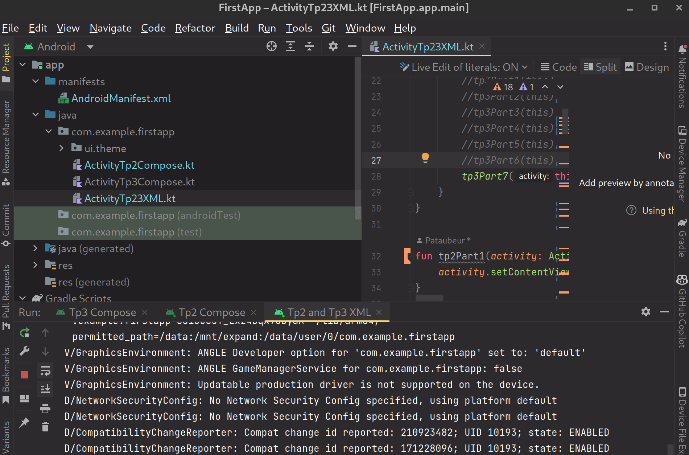
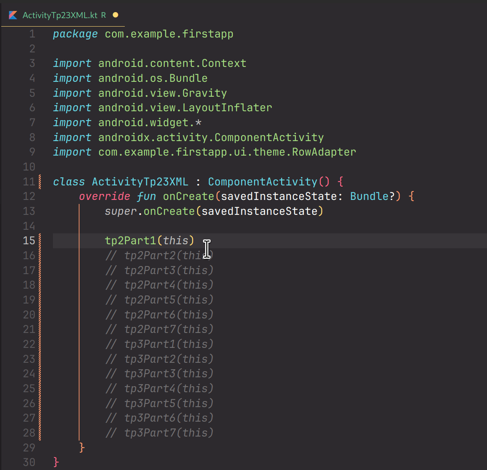

# Introduction

In this project, we will build a simple android application using Android Jetpack.

# Table of Contents

- [Technology choices](doc/1-tech.md)
- [Layouts](doc/2-layouts.md)
- [Data Storage](doc/3-data-storage.md)

# How to run

1. Clone the project
2. Open with Android Studio
3. Build the dependencies
4. Select the activity to run (see below the gif)

***Note** : if you want to run the XML project, you will need to uncomment the parts you want to run in the `ActivityTp23XML.kt` file as shown below.*

